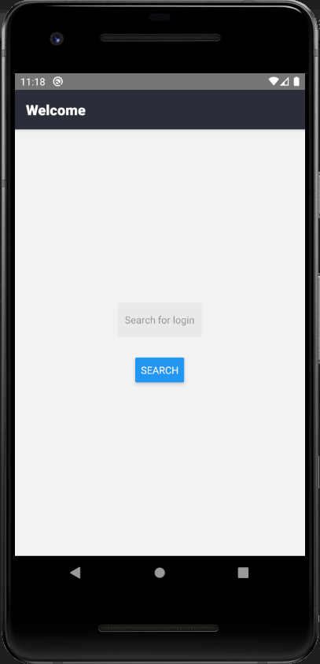
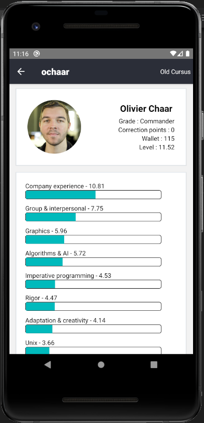
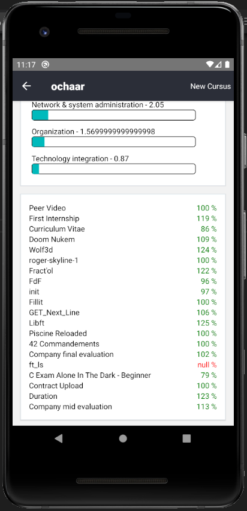

# 42-Swifty-Companion
#### The aim of the projet is to build an application that will retrieve the information of 42 student, using the 42 API.

In this project I used: 42 API, Axios, React native CLI






## Install the app

First, install  Node, Python2, JDK, Yarn and a simulator (and Cocoapods if you are using Mac).

We recommend following this tuto (React Native CLI Quickstart) https://reactnative.dev/docs/environment-setup


Clone the project and run

```
yarn install
```

## Run the app

To run the project, make sure you have a simulator installed on your computer and open 2 terminal.

Launch the metro bundler in the first terminal with

```
npx react-native start
```

In the second terminal, run

```
npx react-native run-android (if you have installed an android simulator)
```

or

```
npx react-native run-ios
```
The first installation can take some times, so be patient.

In the simulator you can CRTL + M or CMD + M to reload app

## Test the app

If you want to test the application on your android phone, clone this repo and run

```
cd android; ./gradlew assembleRelease
```

You will get your released signed APK under /android/app/build/outputs/apk/release directory.

Here is some examples of login you can search for:

- ochaar (my login)
- mifernan
- thor
- ezonda
- 126
- salty
